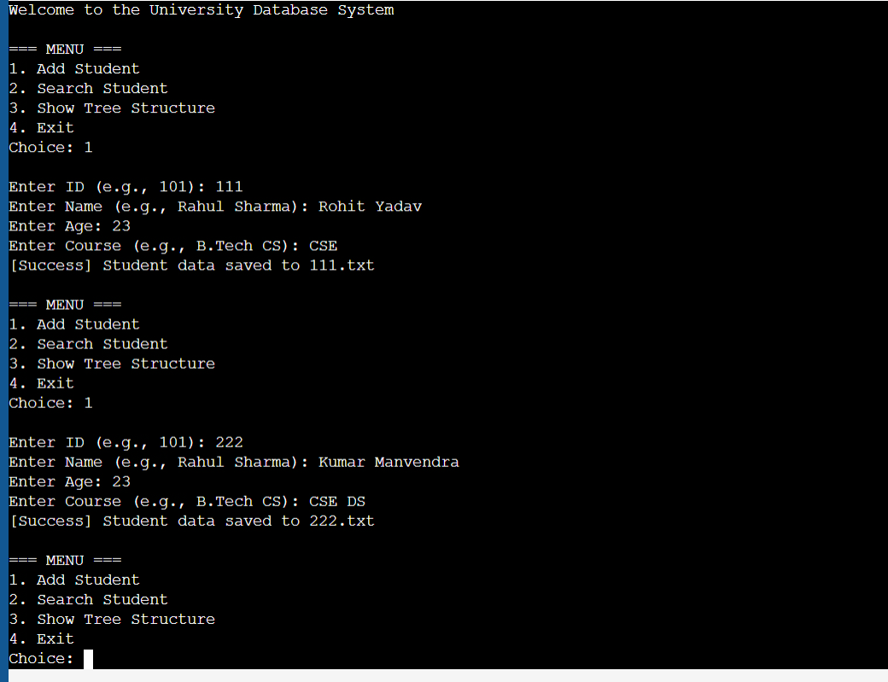
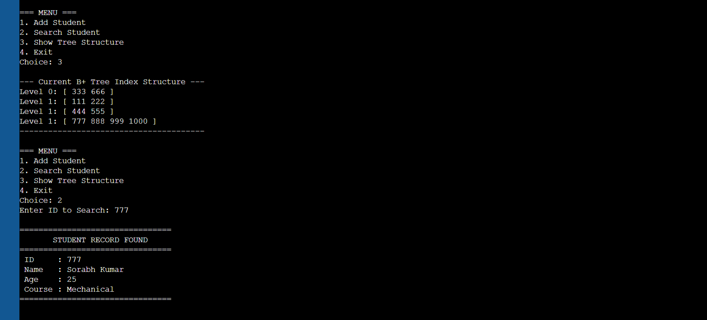
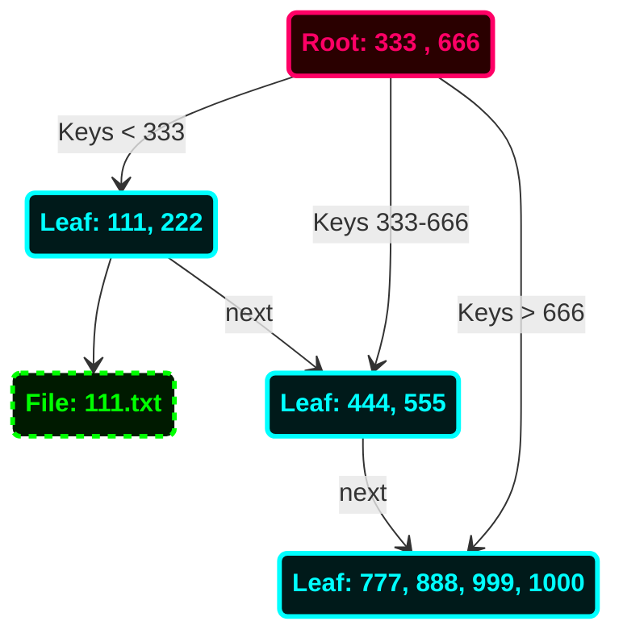
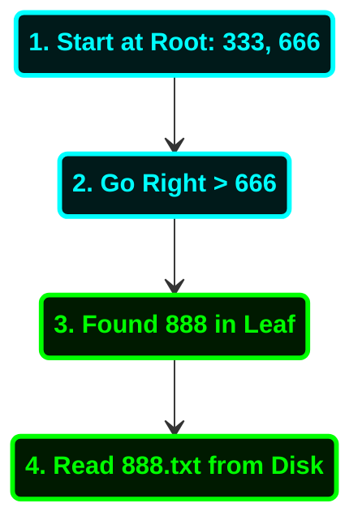
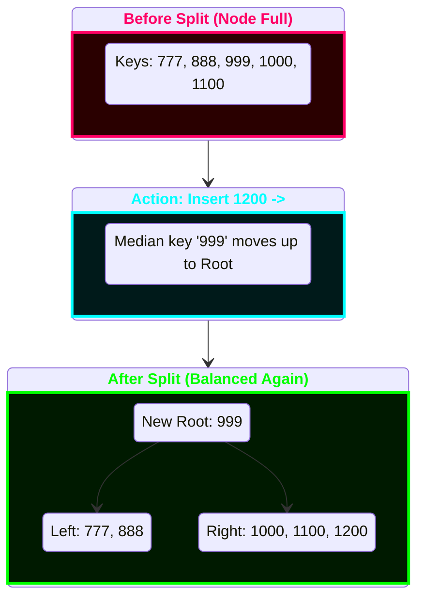

# 🎓 University Data Management System (Custom DBMS)
<br>

  

A high-performance, file-based Database Management System (DBMS) built from scratch in C++. 
This project implements a **B+ Tree** for indexing and uses a **File System** for persistent storage, mimicking real-world database architectures like MySQL or PostgreSQL.
<br>
<br>

---
<br>

## 🚀 Features
* **B+ Tree Indexing:** Utilizes a custom B+ Tree algorithm for optimized **O(log n)** search complexity.
* **Persistent Storage:** Student data (Name, Age, Course) is serialized and saved to disk (`.txt` files), ensuring data persists after the program closes.
* **Crash Handling:** Implements robust input sanitization (`cin.fail()`) to prevent infinite loops on invalid user inputs.
* **CRUD Operations:** Supports Adding students with duplicate checks and Searching records efficiently.
* **Balanced Architecture:** Automatically handles node splitting and merging to keep the tree balanced.
<br>

---
<br>

## 🛠️ Tech Stack
* **Language:** C++ (Standard Template Library)
* **Data Structure:** B+ Tree (Degree `t=3`)
* **Algorithm:** B-Tree Splitting & Merging ("Traffic Sign" Logic)
* **Storage:** File I/O (`fstream`) for persistent data
* **Environment:** Compatible with GCC/G++ compilers (Windows/Linux/Mac)
<br>

---
<br>

## 📸 Project Demo & Walkthrough

### 1. Data Entry & Input Validation


*The clean CLI interface allows users to add student records. The system handles input validation to prevent crashes (e.g., ensuring IDs are numbers).*



<br>

---

<br>


### 2. B+ Tree Visualization & Search


*The "Show Tree" feature visualizes the balanced structure in memory. The Search function then uses this index to instantly locate and retrieve the persistent student file.*

<br>

---
<br>

## 🧠 System Architecture (How It Works)


This system separates **Indexing** from **Data Storage** to maximize efficiency. Below are diagrams visualizing the actual state of the system with sample data (IDs 111–1000).


<br>

### 1. Visualizing the Current B+ Tree State
* **Internal Nodes (Orange):** Act as "traffic signs" to guide traversal. They do not store data pointers.
* **Leaf Nodes (Blue):** Store the actual keys and link to the persistent text files. They are linked horizontally to allow efficient range queries.
<br>


<br>

### 2. Example Search Workflow (Searching ID: 888)


Following the B+ Tree search logic, here is the path taken to locate student ID 888:



<br>

### 3. Future Scenario: Node Splitting


With degree `t=3`, a node is full at 5 keys. The rightmost leaf currently holds 4 keys. Here is how the tree maintains balance if it overflows (e.g., adding IDs 1100 and 1200):




---

<br>

## ⚡ Complexity Analysis


| Operation | Time Complexity | Explanation |
| --- | --- | --- |
| **Search** | `O(log n)` | Logarithmic time due to balanced tree height. |
| **Insert** | `O(log n)` | Includes tree traversal and potential node splitting. |
| **Space** | `O(n)` | Linear space relative to the number of records stored. |

---
<br>

## 🏁 How to Run


1. **Clone the repository:**
```bash
git clone [https://github.com/your-username/CPP-BPlusTree-DBMS.git](https://github.com/your-username/CPP-BPlusTree-DBMS.git)

```
<br>


2. **Compile the code:**
```bash
g++ main.cpp bptree.cpp -o dbms_app

```
<br>


3. **Run the executable:**
```bash
./dbms_app

```
<br>


*(Note: Ensure you have write permissions in the folder so the program can create the `.txt` data files.)*

---

## 📜 License

This project is licensed under the MIT License - see the [LICENSE](https://www.google.com/search?q=LICENSE) file for details.
